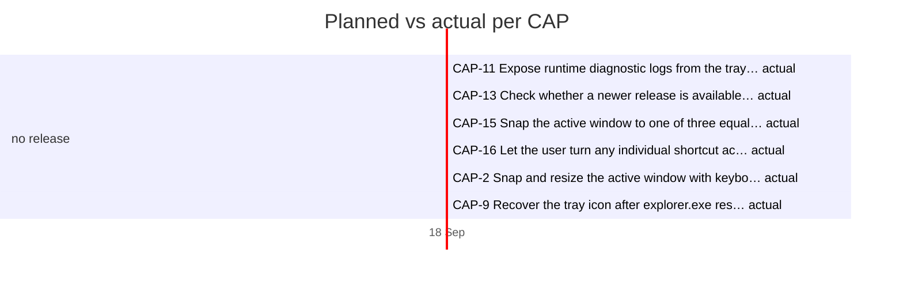

# Timeline

> Generated by `.constitution/method/scripts/timeline.py --generate`. MUST NOT be hand-edited.

As of: **2026-09-18**

## Per CAP

| CAP | Title | Release | Size | Priority | Owner | Planned | Actual | Δ days | State |
|---|---|---|---|---|---|---|---|---|---|
| CAP-1 | Cycle focus among visible windows of the active application via a precise global shortcut. | — | — | — | — | — → — | 2026-09-18 → — | — | in-progress |
| CAP-10 | Launch the daemon silently at logon via a scheduled task without repeated UAC prompts. | — | — | — | — | — → — | 2026-09-18 → — | — | in-progress |
| CAP-11 | Expose runtime diagnostic logs from the tray context menu. | — | — | — | — | — → — | 2026-09-18 → 2026-09-18 | — | done |
| CAP-12 | Move the active window to another physical monitor from the keyboard, keeping its share of the work area. | — | — | — | — | — → — | — → — | — | not-started |
| CAP-13 | Check whether a newer release is available, on a schedule and on request, without any other network activity or identifying payload. | — | — | — | — | — → — | 2026-09-18 → 2026-09-18 | — | done |
| CAP-14 | Snap the active window to a screen edge at a user-configurable percentage instead of a fixed half. | — | — | — | — | — → — | 2026-09-18 → — | — | in-progress |
| CAP-15 | Snap the active window to one of three equal horizontal thirds of the current monitor. | — | — | — | — | — → — | 2026-09-18 → 2026-09-18 | — | done |
| CAP-16 | Let the user turn any individual shortcut action off, returning its chord to Windows instead of leaving it claimed and inert. | — | — | — | — | — → — | 2026-09-18 → 2026-09-18 | — | done |
| CAP-17 | Provide driverless, low-overhead mouse desktop navigation for standard auxiliary mouse inputs (thumb buttons and tilt wheels) with configurable action presets. | — | — | — | — | — → — | 2026-09-18 → — | — | in-progress |
| CAP-2 | Snap and resize the active window with keyboard shortcuts, DPI-aware per monitor. | — | — | — | — | — → — | 2026-09-18 → 2026-09-18 | — | done |
| CAP-3 | Load user preferences from a local TOML file in a writable user directory. | — | — | — | — | — → — | 2026-09-18 → — | — | in-progress |
| CAP-4 | Operate on elevated windows by running the daemon with Administrator privileges. | — | — | — | — | — → — | — → — | — | not-started |
| CAP-5 | Provide on-demand settings and first-run onboarding via a separate settings binary. | — | — | — | — | — → — | 2026-09-18 → — | — | in-progress |
| CAP-6 | Alert the user when the keyboard hook dies at runtime via tray state and one toast. | — | — | — | — | — → — | — → — | — | not-started |
| CAP-7 | Restrict cycling to the same physical monitor and virtual desktop as the active window. | — | — | — | — | — → — | 2026-09-18 → — | — | in-progress |
| CAP-8 | Pass shortcuts through unchanged when the foreground window is a VM or RDP client. | — | — | — | — | — → — | 2026-09-18 → — | — | in-progress |
| CAP-9 | Recover the tray icon after explorer.exe restarts and follow the three-tier error protocol. | — | — | — | — | — → — | 2026-09-18 → 2026-09-18 | — | done |
