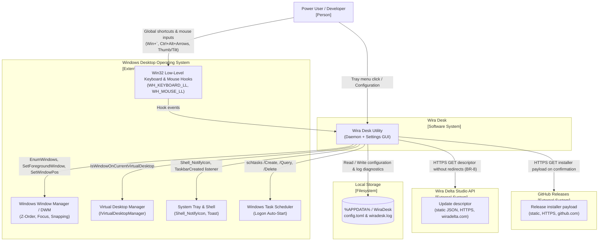

# C4 L1 — System Context

### System Boundaries & Description

- **Wira Desk**: Lightweight, local Windows utility that delivers instant macOS-style same-application window cycling, DPI-aware snapping, and mouse navigation.
- **External Systems**:
  - **Windows Low-Level Hooks**: Intercepts physical key combinations and auxiliary mouse inputs globally before target applications receive them.
  - **Windows Window Manager / DWM**: Live Z-order enumeration, active window focus transitions, DPI-aware bounds retrieval, and window positioning.
  - **Virtual Desktop Manager**: Official COM interface (`IVirtualDesktopManager`) isolating cycling within the active virtual desktop.
  - **System Tray & Toast**: Native Win32 notification icon, context menu, and critical error toast notifications.
  - **Windows Task Scheduler**: Elevation-preserving logon trigger executing silently without repetitive UAC prompts.
  - **Local Filesystem**: Non-volatile storage for user configuration (`%APPDATA%\WiraDesk\config.toml`) and append-only diagnostic log (`%APPDATA%\WiraDesk\wiradesk.log`).
  - **Wira Delta Studio API (`wiradelta.com`)**: Hosts the update check descriptor endpoint polled periodically by the daemon and manually by Settings without redirects (`BR-8`, CAP-13).
  - **GitHub Releases (`github.com`)**: Hosts the release installer binaries and portable archives downloaded upon user confirmation.
- **Network Boundaries**: Exactly two bounded outbound paths. Update descriptor checks query `https://wiradelta.com/api/v1/update/wira-desk/` under `Redirects::Never` carrying strictly the 4-part User-Agent contract (`WiraDesk/<version> (Windows <major>.<minor>.<build>; <arch>)`). Confirmed installer updates download the setup binary from GitHub Releases with SHA-256 validation. Nothing else in the product makes a network connection.
