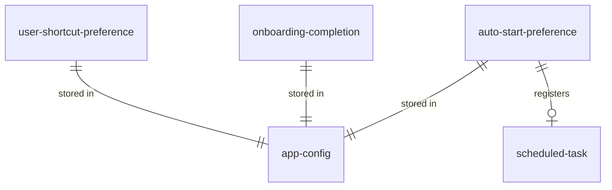

# Data model — settings

Persistent entities are stored in `_platform` entity `app-config` (`%APPDATA%\WiraDesk\config.toml`). This dictionary describes the settings-owned slice of that schema.

## Entity relationship

## user-shortcut-preference

| Column | Type | Nullable | Meaning |
| --- | --- | --- | --- |
| shortcut | string | no | Canonical chord, e.g. `Win+Oem3` |
| fallback_shortcut | string | yes | Optional `Alt+Oem3` fallback |
| snap_half_left | string | no | Half-left snap binding |
| snap_half_right | string | no | Half-right snap binding |
| snap_half_top | string | no | Half-top snap binding (FR-22) |
| snap_half_bottom | string | no | Half-bottom snap binding (FR-22) |
| snap_maximize | string | no | Maximize binding |
| move_next_monitor_shortcut | string | no | Next-monitor move binding (FR-23) |
| snap_percent_left | string | no | Custom-percentage left-edge snap binding (FR-26) |
| snap_percent_right | string | no | Custom-percentage right-edge snap binding (FR-26) |
| snap_percent_top | string | no | Custom-percentage top-edge snap binding (FR-26) |
| snap_percent_bottom | string | no | Custom-percentage bottom-edge snap binding (FR-26) |
| stack_shortcut | string | no | Overlapping stack binding. Default `ctrl+alt+shift+s` (`DEC-011`; was `ctrl+alt+shift+down` until the arrow tier above was freed for the four `snap_percent_*` rows) — placed **after** them in this declared sequence on purpose: on an install still holding the retired default, the percent-snap row must resolve the chord first, per `DEC-011`'s cost and the `DEC-009` mechanism it relies on |
| snap_third_left | string | no | Left-third snap binding (FR-27) |
| snap_third_middle | string | no | Middle-third snap binding (FR-27) |
| snap_third_right | string | no | Right-third snap binding (FR-27) |
| `<action>`_enabled | bool | no | Per-action enabled/disabled flag, one per row above, independent of its chord string. Verified (FR-28): `ShortcutField::is_enabled`/`set_enabled`/`set_action_enabled` (`crates/settings/src/app.rs`). Disabling never clears the chord column; re-enabling reads the same stored chord back. Distinct from `unbound`, which this table never records — that state is `window-management`'s runtime derivation, not a persisted value (`BR-9`). **Defaults to `true` on every existing install's config, not Rust's derived `bool` default of `false`** — `shared::Config`'s structs carry `#[serde(default)]` at the container level, so a missing field is filled from that struct's own hand-written `Default` impl rather than the primitive default, and every one of these sixteen fields' `Default` arm sets it to `true` explicitly. |

### Dictionary

- The **row order above is the declared sequence** `LBR-ST-14` names: the Shortcuts pane is drawn from it, keyboard focus follows it, and a chord collision is resolved in favour of whichever row comes first. There is no second list.
- Grouping the rows under headings in the pane is a presentation concern and belongs to `.how/settings/01-ux/DESIGN.md`. It must not reorder them relative to this sequence.
- Every value is a **canonical** chord string. Two rows holding the same canonical string is the collision condition `BR-6` governs; this component refuses to save it at all.

Schema source: `shared::Config` in `crates/shared/src/config.rs`.

## arrangement-percentage-preference

The percentage each `snap_percent_*` chord snaps to — a value, not a chord, so it is not part of the
declared sequence above and cannot collide with anything (FR-26).

| Column | Type | Nullable | Meaning |
| --- | --- | --- | --- |
| percent_left | u8 | no | Percentage of work-area width, left edge. Default `67` |
| percent_right | u8 | no | Percentage of work-area width, right edge. Default `67` |
| percent_top | u8 | no | Percentage of work-area height, top edge. Default `67` |
| percent_bottom | u8 | no | Percentage of work-area height, bottom edge. Default `67` |

## onboarding-completion

| Column | Type | Nullable | Meaning |
| --- | --- | --- | --- |
| tutorial_completed | bool | no | User finished interactive practice |
| skipped | bool | no | User chose Skip Tutorial |

## auto-start-preference

| Column | Type | Nullable | Meaning |
| --- | --- | --- | --- |
| enabled | bool | no | Whether logon task is registered |
| task_name | string | no | `WiraDesk` (`shared::TASK_NAME`) |

## scheduled-task (external)

Not stored in TOML; created by `schtasks` when `enabled` is true.

| Column | Type | Meaning |
| --- | --- | --- |
| trigger | ONLOGON | Runs at user logon |
| run_level | HIGHEST | Matches daemon elevation (AD-13) |
| run_as | `%USERNAME%` | Aligns APPDATA paths (BR-4) |
